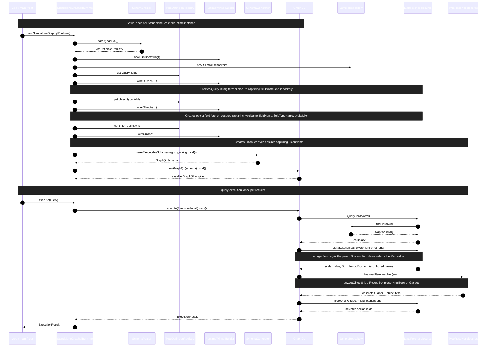

# Standalone GraphQL Runtime Example

This directory contains a minimal GraphQL Java example.

The example shows four things:

1. A simple SDL in `src/main/resources/library.graphqls`
2. Parsing that SDL into a `TypeDefinitionRegistry`
3. Auto-wiring resolvers by iterating over SDL object and union definitions
4. Using small `Box` objects so nested resolvers can read `env.getSource()`, and a `RecordBox`
   so union resolution can recover the concrete member type

The chosen domain is intentionally small:

- `Query.library(id: ID!): Library`
- `Library.shelves: [Shelf!]!`
- `Library.highlighted: FeaturedItem`
- `Shelf.featured: FeaturedItem`
- `FeaturedItem = Book | Gadget`

## Request and resolver sequence

The important split is that resolver setup happens in `StandaloneGraphqlRuntime()` when the
`GraphQL` instance is constructed. Actual resolving happens later, per call to `execute(query)`,
when GraphQL Java invokes the already-registered `DataFetcher` and `TypeResolver` closures.



In other words, the `TypeDefinitionRegistry` and SDL inspection are setup inputs. They are used to
create runtime wiring and closures, but they are not re-inspected for each field during query
execution. During execution, GraphQL Java walks the query against the executable schema and calls the
closures that were registered during setup.

## Closure trick

Each field resolver is created while iterating over the SDL. The resolver captures:

- the GraphQL type name
- the field name
- the unwrapped field type
- whether the field is scalar-like or object-like

This "closure trick", is based on expensive SDL inspection happening once up front, 
and that information is captured at setuptime so that when GraphQL Java later invokes
a tiny closure per requested field, it is based on information that was available at
setup time. The resolver becomes very simple.

## Box trick

Root resolvers return a `Box` rather than a raw `Map`. Nested resolvers then do:

- `env.getSource()` -> parent `Box`
- `box.value(fieldName)` -> underlying field value
- scalar values are returned directly
- object or union values are wrapped in a new `Box`

For union members, the runtime wraps the value in a `RecordBox` that preserves the concrete type
name (`Book` or `Gadget`). The union `TypeResolver` uses that information to choose the GraphQL
object type.

## Files

- `src/main/resources/library.graphqls`: SDL
- `src/main/java/example/graphql/StandaloneGraphqlRuntime.java`: runtime, sample data, and `main`
- `src/test/java/example/graphql/StandaloneGraphqlRuntimeTest.java`: executes a sample query

## Run

```bash
mvn test
mvn exec:java
```

The `main` method runs a sample query and prints the JSON result.
